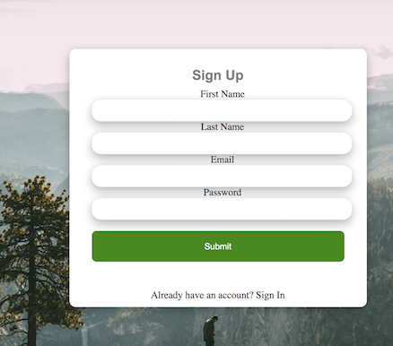

# LongTrails
LongTrails is a clone of AllTrails with the name being inspited by a trail I've hiked many times, the Long Trail. Stretching the length Vermont all the way to Canada! 

 

## Technologies

## Functionality and MVP 
- Ruby on Rails
- React/Redux 
- PostgreSQL
- JavaScript/AJAX/JBuilder 
- HTML5/CSS

## Features 

* User Authentification

    Users have the ability to securly sign up on the website.   

    

    

* Reviews/Ratings

    On a trails index page. Users can see all the reviews and a 1-5 rating for each. When a user is signed in they have the option to leave their own review on the page. I was able to do this by down the current user using React/Redux state managment. By using this same logic, I was able to only users to edit or delete their comments only if they were the author. 

    

    

* Search Trails

    On the homepage, trail index page, or park index page, users can search for a hike or park in the area. I was able to use the query string to filter out trail or park names that did not match the user input. 

    

* Next Feature
    - Incorperating AWS to allow users to upload pictures from their hikes
    - Creating a users profile page

